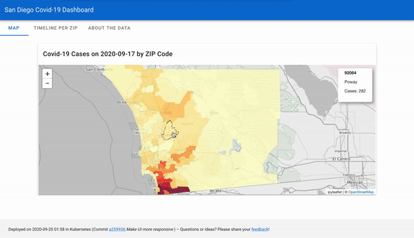

# San Diego COVID-19 Dashboard
*A self-updating data application on Kubernetes in the Cloud*

> “How are COVID-19 cases evolving in my San Diego neighborhood?”



This project primarily serves as an example of how to deploy a self-updating data application on Kubernetes in the 
cloud, using automated continuous integration workflows. Secondarily, the project offers a refined view on San Diego 
County COVID-19 data through a dashboard that focuses on breaking down case data by ZIP code.

**Dashboard URL:** [http://"34.121.64.145"](http://"34.121.64.145") 


## Table of Contents

  * [Pipeline Status](#pipeline-status)
  * [Infrastructure](#infrastructure)
    + [Continuous Deployment Pipelines](#continuous-deployment-pipelines)
    + [Cloud Foundation Layer: Google Cloud + Terraform](#cloud-foundation-layer--google-cloud---terraform)
    + [Kubernetes Foundation Layer](#kubernetes-foundation-layer)
      - [Local Development](#local-development)
    + [App Layer](#app-layer)
      - [Crawler](#crawler)
      - [Dashboard](#dashboard)
  * [Contributing](#contributing)
  * [Credits](#credits)
  * [License](#license)

## Pipeline Status

This section tracks the status of the various production continuous integration pipelines.

**Cloud Foundation Layer** 


**Kubernetes Foundation Layer**


**App Layer**

|  | Docker Build | Built Image | K8s Deployment |
|-|-|-|-|
| Crawler |  | [](https://microbadger.com/images/flrs/sd_covid_dashboard_crawler "Get your own version badge on microbadger.com") |  |
| Dashboard |  | [](https://microbadger.com/images/flrs/sd_covid_dashboard_dashboard "Get your own version badge on microbadger.com") |  |

## Infrastructure

This section describes the project's infrastructure. The infrastructure is built with the following requirements in 
mind:

- Have a module to automatically download new data (*crawler*)
- Have a module to store new data (*database*)
- Have a module to display analyses of those data (*dashboard*)
- Be small-scale, since very little traffic is expected
- Be relatively affordable to run
- Be easy to update and maintain, so experiments can be run at low cost

As a direct result of these requirements, the project features a great amount of automation. Since the prime use case 
for cloud computing is big-scale, and not of small-scale deployments (and may come with a bill to match), the project 
uses a custom cloud infrastructure that minimizes cost.

The below chart gives an overview of the repository's components:

```
.github/ <-- Continuous integration pipelines
crawler/ <-- Component: Crawler for getting COVID-19 case data
dashboard/ <-- Component: Dashboard for displaying case data 
docs/ <-- Documentation
k8s/ <-- Kubernetes manifests
  base/ <-- Common manifests for dev and production stages
  overlays/
    dev/ <-- Manifests for development stage (local)
    prod/ <-- Manifests for production stage (in cloud)
notebooks/ <-- Jupyter notebooks for exprimenting with data
terraform/ <-- Terraform configurations for Kubernetes and 
               database deployment on Google Cloud
```

### Continuous Deployment Pipelines

A good starting point for understanding how this repository works are the continuous deployment pipelines. They 
connect development to deployment. All continuous deployment pipelines are implemented as 
[GitHub Actions workflows](https://github.com/features/actions). Here are the typical use cases the pipelines cover:

- **Deploy Infrastructure on GCP** *(GCP: Google Cloud Platform)* At the beginning, your Google cloud account includes no 
  resources related to this project whatsoever. The 
  [deploy_infrastructure_gcp](.github/workflows/deploy_infrastructure_gcp.yml) workflow uses 
  [Terraform](https://terraform.io) to provision a Kubernetes cluster with a pre-defined set of nodes, a Postgres 
  database, and related roles and permissions on your Google cloud account. These components are the foundation this 
  app needs to run in the cloud.
  
- **Deploy App on GKE** *(GKE: Google Kubernetes Engine)* The [deploy_app_gke](.github/workflows/deploy_app_gke.yml) 
  workflow deploys all components of the app into the Kubernetes cluster created on GCP. 
  
  The workflow also takes care of updating the Kubernetes deployment when any of the components change. For example, 
  the workflow will rollout dashboard updates on Kubernetes when a new Docker image for the dashboard is available.
  
- **Build Docker Crawler/Build Docker Dashboard** The [build_docker_crawler](.github/workflows/build_docker_crawler.yml)
  and [build_docker_dashboard](.github/workflows/build_docker_dashboard.yml) workflows build the crawler and dashboard 
  Docker images and push them onto [DockerHub](https://hub.docker.com/u/flrs). The workflows are triggered whenever
  resources belonging to one of these app components, located either in the [crawler](./crawler) or 
  [dashboard](dashboard) directories, are changed.
  
- **Destroy Infrastructure on GCP** The manually-triggered 
  [destroy_infrastructure_gcp](.github/workflows/destroy_infrastructure_gcp.yml) action uses Terraform to remove all
  resources created on Google cloud. This is useful during development or when the project has reached its end of life.
  
### Cloud Foundation Layer: Google Cloud + Terraform

Terraform creates several resources on Google Cloud to make this project work. The [terraform templates](terraform) 
are based on [Niko Kosonen's tutorial](https://dev.to/verkkokauppacom/how-to-kubernetes-for-cheap-on-google-cloud-1aei)
and the associated [gke-tutorial GitHub repository](https://github.com/nkoson/gke-tutorial/tree/b2279e72dc65a4a62b9fec779135d48473a66e91).

Niko's terraform templates help to build a small-scale Kubernetes cluster on Google Cloud that circumvents Google's 
default load balancer. For very small clusters, the default load balancer often adds significant cost. Niko's solution 
 is much less costly and its performance aligns better with the low performance demands of a small cluster. The next 
 section describes the Kubernetes infrastructure in more detail.

For this project, Niko's terraform templates have been extended with a 
[Google Cloud SQL Postgres database](terraform/gke/database.tf) and some 
[output variables](terraform/cluster.tf#L107) to ease continuous deployment. The 
[deploy_infrastructure_gcp](.github/workflows/deploy_infrastructure_gcp.yml#L96) workflow uses the Terraform outputs to 
write, encrypt and commit secrets to this repo, so that they can be picked up in the 
[deploy_app_gke](.github/workflows/deploy_app_gke.yml#L60) workflow.

### Kubernetes Foundation Layer

After the cloud foundation has been laid by terraform, the Kubernetes infrastructure can now be built on top of it. 
Kubernetes manifests for production deployment are stored in the [k8s/overlays/prod](k8s/overlays/prod) direct.

Once again, a good part of the Kubernetes infrastructure comes from 
[Niko Kosonen's tutorial](https://dev.to/verkkokauppacom/how-to-kubernetes-for-cheap-on-google-cloud-1aei). The 
Kubernetes cluster has two nodes. One node serves as an ingress to the cluster and has a static IP that can be 
accessed by the public. Tying a static IP
to the ingress node is the task of [KubeIP](https://kubeip.com/). The other node is ephemeral and hosts all pods
needed for running the apps. [Traefik](https://docs.traefik.io/) is deployed as an internal load balancer in the 
cluster and routes incoming traffic to the apps.

The app's crawler is triggered by a CronJob. Native Kubernetes CronJobs are not timezone-aware and run in the timezone
of the hosting node, which is typically UTC. New COVID-19 data from San Diego County becomes available at a point in 
time relative to Pacific Time. Pacific Time observes Daylight Savings Time. As a result, the offset to UTC changes
throughout the year. The Kubernetes-native CronJob does not support changing offsets. As an alternative, this project
uses Hidde Beydals' timezone-aware [CronJobber](https://github.com/hiddeco/cronjobber) and deploys it 
[alongside](.github/workflows/deploy_app_gke.yml#L114) the other manifests. 

The resulting Kubernetes deployment has 4 namespaces, `default`, `kube-system`, `traefik`, and `dashboard`.

| `default` namespace | `traefik` namespace |
| -| -|
|  |  |

#### Local Development

This repository also contains a [Skaffold](https://skaffold.dev/) [pipeline](skaffold.yaml) that helps to develop and 
deploy the project on a local machine. The [k8s/overlays/dev](k8s/overlays/dev) directory contains the associated 
Kubernetes manifests.

### App Layer

The app layer consists of 2 components: The [crawler](crawler) and the [dashboard](dashboard).

Both components use Kubernetes' `dashboard` namespace:


#### Crawler

The [crawler](crawler)'s job is to acquire San Diego County's COVID-19 data and store it in the project's database, so that it can
be received by the dashboard. The crawler is a implemented as [Python script](crawler/main.py).

It is triggered by a timezone-aware CronJob as described above. In addition to this CronJob, the Kubernetes deployment 
also includes a [job](k8s/overlays/prod/crawler-seedjob.yaml) to seed the database with previously crawled data, 
saving traffic. This job is run once, at initialization of the app layer cluster. 

#### Dashboard

The [dashboard](dashboard) is the user-facing part of the application. It is implemented as a 
[voila application](https://github.com/voila-dashboards/voila) and uses 
[voila-vuetify](https://github.com/voila-dashboards/voila-vuetify) to render a material UI-style user interface.

In comparison to other dashboarding tools, Voila is relatively slow. However, great user-facing performance is not a 
requirement for this project. Voila was chosen because it makes it easy to create working data applications fast, based
on [Jupyter Notebooks](dashboard/app.ipynb).

## Contributing

For questions or feedback, please file an issue here on GitHub. You may also use the 
[feedback form](https://survey.survicate.com/a8285d0a4afe7aa3/) from within the app.

Feel free to open pull requests for any changes you think the project could benefit from.

## Credits

- Niko Kosonen's tutorial [How to: Kubernetes for Cheap on Google Cloud](https://dev.to/verkkokauppacom/how-to-kubernetes-for-cheap-on-google-cloud-1aei)
  and the associated [GitHub repository](https://github.com/nkoson/gke-tutorial)

- Hidde Beydals' [Cronjobber](https://github.com/hiddeco/cronjobber) for Kubernetes

## License

This project is published under the [MIT License](LICENSE.md).
